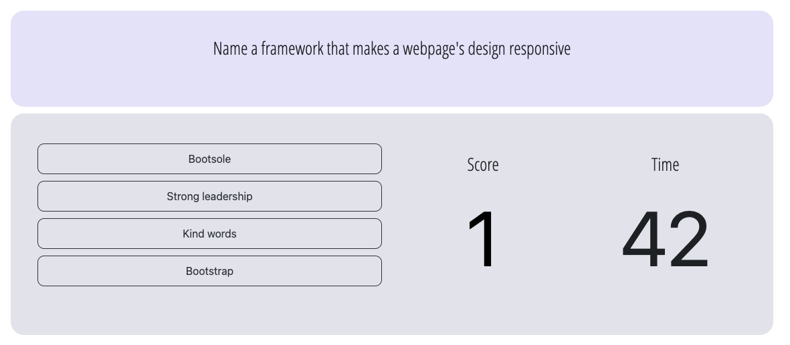

# quiz-game
Quiz game

Link https://r-a-exe.github.io/quiz-game/

## High-Level Description

Timed and scored quiz game.

## Game Flow

The webpage loads the main prompt with the instructions and two buttons: Start, to start the game, High Scores to view the high scores list.

### Start the game

Upon clicking Start, the following actions take place:
    
    1- The main prompt displays the first question;
    2- The dashboard appears, containing:
        - The possible answers;
        - The score (starting at 0);
        - The count down (starting at 60 seconds) already started.

### Answering questions

Upon choosing an answer, the following actions take place:
    
    1- If the answer is correct:
        - The score is incremented by 1 point;
        - The next question is loaded.

    2- If the answer is incorrect:
        - The timer is decremented by 10 seconds;
        - The next question is loaded.

### Finishing

Upon answering the last question, the quiz ends, and the initials form is loaded. This form shows the player the final score, and allows them to enter their initials. 

Upon submitting the form, the following actions take place:
    
    1- The initials and score are added to local storage;
    2- The High Scores table is displayed, sorted by score.

In order to exit the High Scores view, the player can click anywhere inside the viewport.
